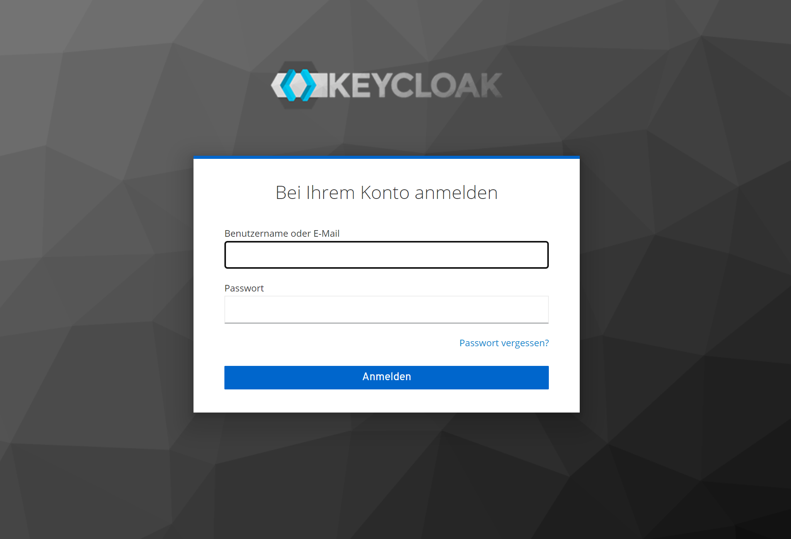
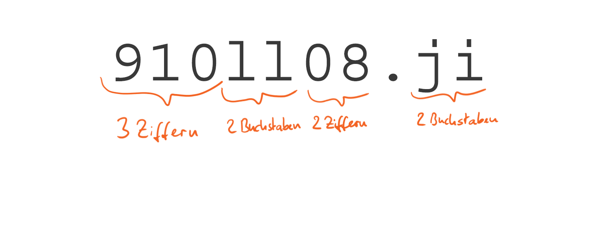
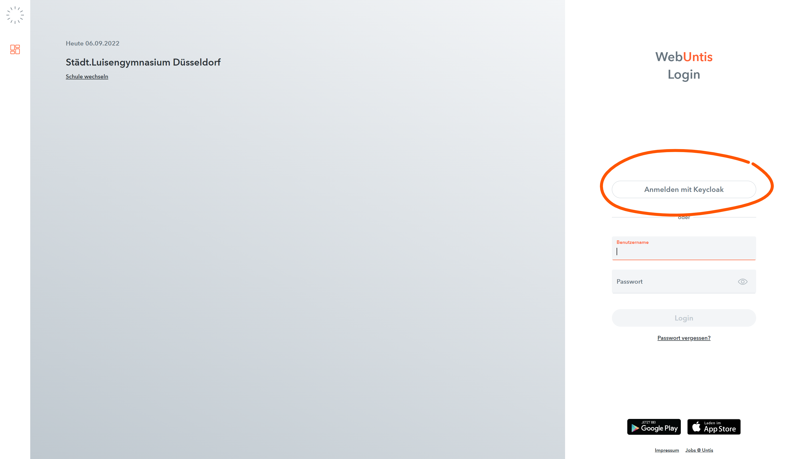
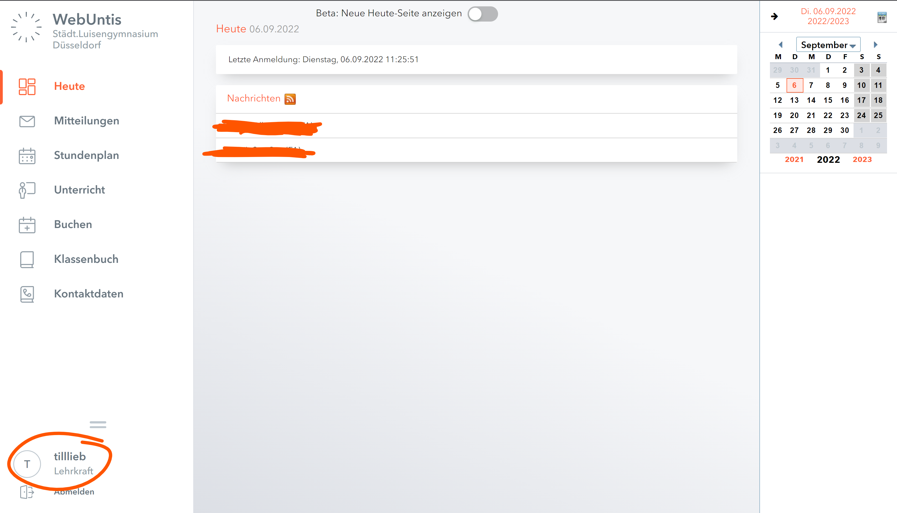
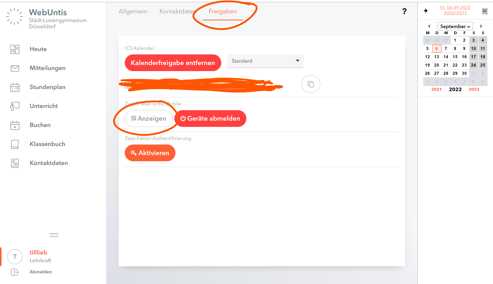
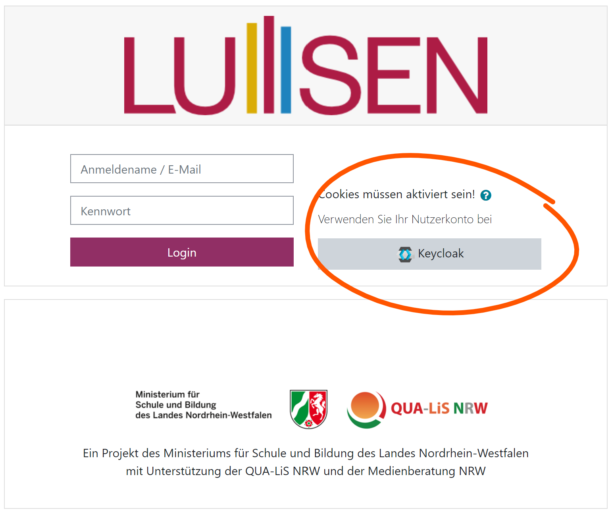
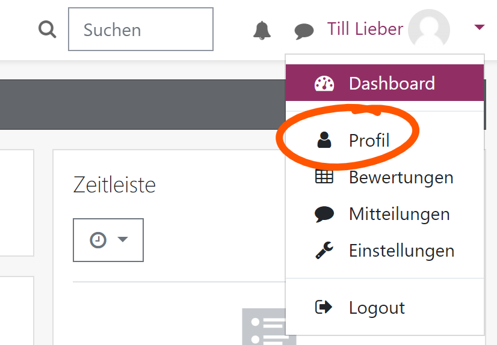
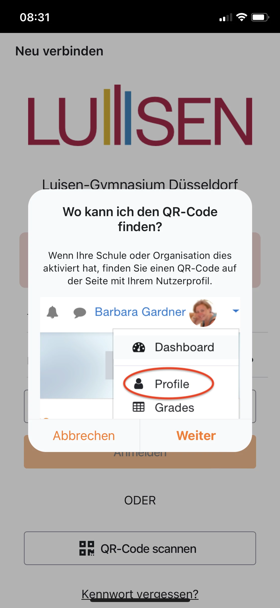

# Initialer Login
Egal für welche der drei Plattformen du dich entschieden hast (bitte einfach hier in der Anleitung die gewünschte Plattform auswählen und dort nachlesen, wie der Login zu geschehen hat), erreichst du den folgenden Login Screen:

{ loading=lazy }

Hier gibst du die dir mitgeteilten Login Daten ein. Sollte dies auf analogem Weg geschehen sein, so gilt für das System des Passworts folgendes (da es manchmal nicht eindeutig erkennbar ist):

{ loading=lazy }
Sollte es digital übermittelt worden sein, bietet es sich an, die Daten einfach per copy & paste einzufügen, dann sind Fehler beim Abschreiben ausgeschlossen.

Nach erfolgreicher Eingabe der Login Daten wirst du aufgefordert, dir ein neues Passwort (zweimal) zu geben, anschließend bist du eingeloggt.

## Login Webuntis
Im folgenden wird der Login per Browser und die Einrichtung der App beschrieben.

### Browser
Gehe bitte zur URL [webuntis.luisen-gymnasium.de](http://webuntis.luisen-gymnasium.de) (dies ist nur eine Weiterleitung auf die tatsächliche URL [https://ajax.webuntis.com/WebUntis/?school=luisen-gym-duesseldorf](https://ajax.webuntis.com/WebUntis/?school=luisen-gym-duesseldorf.md).

{ loading=lazy }

Dort klickst du auf den **keycloak** Button und logst dich mit deinen Zugangsdaten ein. 

Welche Funktionen Webuntis bietet und welche davon wir in der Schule nutzen wollen, erfährst du in der Anleitung zu [Webuntis](Anleitungen-webuntis.md).

### App
Es gibt für Webuntis eine App. Diese ist sehr praktisch um während der Schulzeit aktuelle Informationen über Vertretungen und Unterrichtsausfall zu erhalten. Zwingend erforderlich ist die Installation nicht, der Funktionsumfang der Website ist gerade für Lehrkräfte auch deutlich größer, in gewissen Situationen ist sie aber deutlich praktischer.

iOS: [webuntis](https://apps.apple.com/de/app/untis-mobile/id926186904)

Android: [webuntis](https://play.google.com/store/apps/details?id=com.grupet.web.app&hl=de&gl=US)

Um die App einzurichten musst du (mehr oder weniger) zwingend den Login mit QR-Code wählen. Dafür logst du dich wie oben erklärt über den Browser ein und klickst anschließend unten links auf deinen Benutzernamen. 

{ loading=lazy }

Anschließend gehst du oben auf **Freigaben** und dann auf **Anzeigen**.

{ loading=lazy }

Den dann angezeigten QR-Code musst du mit der Webuntis-App einscannen und die App ist verbunden.

## Login Moodle
Im folgenden wird der Login per Browser und die Einrichtung der App beschrieben.

### Browser
Gehe bitte zur URL [lms.luisen-gymnasium.de](http://lms.luisen-gymnasium.de) (dies ist nur eine Weiterleitung auf die tatsächliche URL der Landesplattform [https://164501.logineonrw-lms.de](https://164501.logineonrw-lms.de)).

Dort klickst du auf den **keycloak** Button und logst dich mit deinen Zugangsdaten ein. 

{ loading=lazy }

>**Wichtig:**
>Es sind 2 Spezialfälle zu beachten:
>
>Im Falle, dass dies der erste Login überhaupt in **keycloak** ist, siehe: **# Initialer Login**
>
>Im Falle, dass es der erste Login in **LogineoNRW LMS** ist, erscheint nach erfolgreichem Login, dass eine Mail mit einem Bestätigungslink an eine dir unbekannte Mailadresse versandt wurde.  **Das ist alles korrekt! Du wirst dann in den nächsten Stunden von einem Lehrer freigeschaltet.**

Welche Funktionen LogineoNRW LMS (Moodle) bietet und welche davon wir in der Schule nutzen wollen, erfährst du in der Anleitung zu [LogineoNRW LMS (Moodle)](Anleitungen-moodle.md).

### App
Es gibt für Moodle (Das Open Source Produkt, welches LogineoNRW LMS verwendet) eine App. Diese ist nicht zwingend erforderlich, ermöglicht aber den Erhalt von Push-Nachrichten, falls bspw. neue Aufgaben erscheinen.

iOS: [Moodle](https://apps.apple.com/de/app/moodle/id633359593)

Android: [Moodle](https://play.google.com/store/apps/details?id=com.moodle.moodlemobile&hl=de&gl=US)

>**Wichtig:**
>Du kannst dich weder in dieser, noch in den Apps der anderen Plattformen mit den **keycloak**-Zugangsdaten anmelden!

Um die App mit dem Account zu verbinden, musst du dich im Browser wie oben beschrieben einloggen. Anschließend navigierst du oben rechts auf den Accountbereich und wählst dort **Profil**:

{ loading=lazy }

>Im Profil befindet sich ganz unten der Bereich **Mobile App**, dort klickst du auf **QR-Code anzeigen** und scannst den erscheinenden QR-Code nun **MIT DER MOODLE-APP** ein.

{ loading=lazy }

In der App selbst ist auch nochmal eine kleine Erläuterung zum Vorgehen vorhanden.

## Login Nextcloud
Im folgenden wird der Login per Browser und die Einrichtung der App beschrieben.

### Browser
Gehe bitte zur URL [nc.luisen-gymnasium.de](http://nc.luisen-gymnasium.de) (dies ist nur eine Weiterleitung auf die tatsächliche URL [https://nc.luisen.collox.de](https://nc.luisen.collox.de)).

Dort logst du dich mit deinen Zugangsdaten für **keycloak** ein. 
(Im Falle, dass dies der erste Login überhaupt in **keycloak** ist, siehe: **# Initialer Login**).

Welche Funktionen die Nextcloud bietet und welche davon wir in der Schule nutzen wollen, erfährst du in der Anleitung zur [Nextcloud](Anleitungen-nextcloud.md).

### App
Für die Funktionen, die wir am Luisen verwenden benötigen wir zwei Apps:

**iOS:**
- [Nextcloud App](https://apps.apple.com/de/app/nextcloud/id1125420102)
- [Nextcloud Talk App](https://apps.apple.com/de/app/nextcloud-talk/id1296825574)

**Android:**
- [Nextcloud App](https://play.google.com/store/apps/details?id=com.nextcloud.client&hl=de&gl=US)
- [Nextcloud Talk App](https://play.google.com/store/apps/details?id=com.nextcloud.talk2&hl=de&gl=US)

