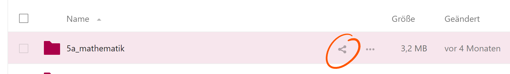
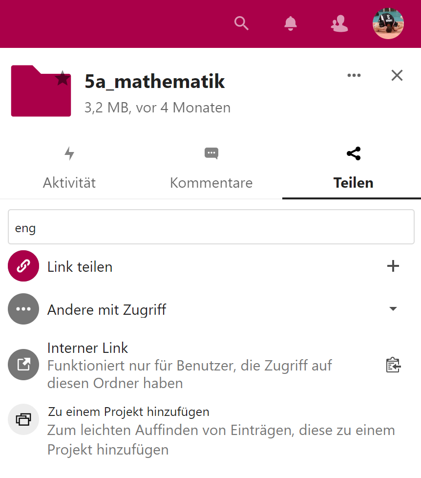
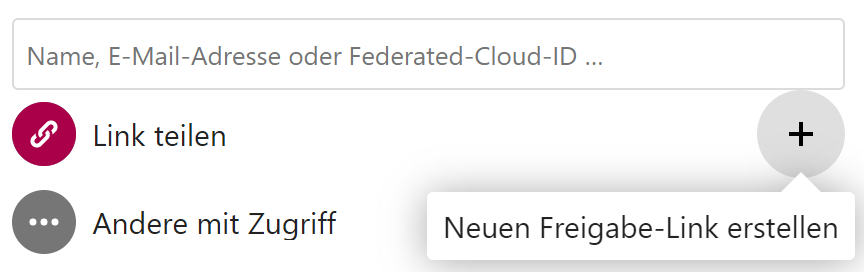

# Nextcloud

Solltest du dich noch nie in einer der Plattformen eingeloggt haben oder Probleme beim Einloggen haben, so lies bitte erst die [Anleitung zum Login](index.md).

## Dateien

Die Dateienapp ist das Herzstück von Nextcloud, da das gesamte Projekt ursprünglich als Cloudspeicher konzipiert wurde. Um als Alternative zu MS365, Google Workspace und ähnlichem bestehen zu können, wurden später die anderen "Apps" hinzugefügt.

### Dateien teilen

Man kann Dateien und Ordner einzelnen Personen, Gruppen von Personen oder ganz öffentlich jedem zur Verfügung stellen.

Um eine Datei oder einen Ordner zu teilen muss zuerst auf das "Teilen"-Symbol geklickt werden. 

Nun öffnet sich das "Teilen"-Menü:

<figure markdown> { loading=lazy style="margin:auto;width:60%" } <!-- <figcaption>Abbildung 1: Digitalstruktur am Luisen-Gymnasium</figcaption> --> </figure>

Möchte man eine Datei (oder Ordner) jemandem nochmals kurz zeigen, mit dem diese (dieser) bereits geteilt ist, so kann man einfach bei "Interner Link" auf das "Zwischenablage"-Symbol klicken und diesen Link versenden. Ist dies aber noch nicht geschehen, muss man sich entscheiden, auf welche Art man die Datei teilen möchte, "innerhalb der Schulgemeinschaft", was deutlich speziellere Rechteeinstellungen erlaubt, oder per Link an Externe und damit jeden, der den Link erhält.

#### Teilen innerhalb der Schulgemeinschaft

Zum Teilen innerhalb der Schulgemeinschaft gibt man in das Suchfeld einen Teil desjenigen an, mit dem man teilen möchte. Anschließend werden einem relativ schnell per Autovervollständigung mögliche User, Gruppen, Kreise (hier nicht sichtbar) oder Talk-Konversationen angezeigt.

> **Wichtig:** Bei Benutzung der App funktioniert die Autovervollständigung nicht, dort muss der Suchbegriff abgeschickt werden ("Enter"), damit passende Vorschläge angezeigt werden!

<figure markdown> { loading=lazy style="margin:auto;width:60%" } <!-- <figcaption>Abbildung 1: Digitalstruktur am Luisen-Gymnasium</figcaption> --> </figure>

Im Bild ist erkennbar wie Nextcloud anzeigt, ob der Vorschlag eine Person (dann ist nichts am rechten Rand sichtbar und man sieht in grau die (Pseudo-)-Mailadresse unter dem Namen), eine Gruppe (Das Symbol mit den zwei Personen) oder eine Talk-Unterhaltung (die Sprechblase) ist.

<figure markdown> { loading=lazy style="margin:auto;width:60%" } <!-- <figcaption>Abbildung 1: Digitalstruktur am Luisen-Gymnasium</figcaption> --> </figure>

Wurde eine Datei (oder Ordner) erfolgreich innerhalb der Schulgemeinschaft geteilt, so sieht man im Anschluss (meistens erst nach einem Reload der Seite), dass neben dem "Teilen"-Symbol nun ein "Geteilt" steht.

#### Teilen mit Externen

Möchte man eine Datei (oder Ordner) per Link teilen, dies ist notwendig, wenn diese auch Leute außerhalb der Schulgemeinschaft sehen/bearbeiten/erstellen können sollen, dann muss man einen neuen "Freigabe-Link" erstellen.

<figure markdown> { loading=lazy } <!-- <figcaption>Abbildung 1: Digitalstruktur am Luisen-Gymnasium</figcaption> --> </figure>

Nachdem dieser erstellt wurde kann man über das "drei Punkt"-Symbol neben dem "Zwischenablage"-Symbol einstellen, welche Rechte den Leuten zustehen.

<figure markdown> { loading=lazy style="margin:auto;width:60%" } <!-- <figcaption>Abbildung 1: Digitalstruktur am Luisen-Gymnasium</figcaption> --> </figure>

**Rechte:**

* **Schreibgeschützt:** Datei oder Ordner kann nicht geändert werden, im Falle eines Ordners können auch keine neuen Dateien erstellt werden.
* **Hochladen und Bearbeiten erlauben (Nur bei Ordnern):** User dürfen Dateien innerhalb des geteilten Ordners verändern und neue Dateien erstellen.
* **Download verbergen:** Entfernt den Button zum Herunterladen von Dateien (ist aber für "versierte" Nutzer trotzdem noch möglich).
* **Passwortschutz:** Erfordert nach Eingabe des Links noch eine Passworteingabe um die geteilten Inhalte ansehen zu können.
* **Videoüberprüfung:** Für unseren usecase nicht von Interesse.
* **Ablaufdatum setzen:** Ermöglicht es ein Datum zu setzen, zu dem der Freigabe-Link automatisch abläuft.
* **Notiz an Empfänger:** Für unseren usecase bei der Link-Freigabe nicht von Interesse.
* **Freigabe aufheben:** Beendet die Freigabe.
* **Weiteren Link hinzufügen:** Fügt einen weiteren Link hinzu, dem man dann andere Rechte mitgeben kann.

Wurde eine Datei (oder Ordner) erfolgreich innerhalb über eine Link-Freigabe geteilt, so sieht man im Anschluss (meistens erst nach einem Reload der Seite), dass anstatt des "Teilen"-Symbols nun ein "Link"-Symbol erscheint und rechts davon nun ein "Geteilt" steht.

### (kollaboratives) arbeiten mit Office-Programmen

Innerhalb der Nextcloud lässt sich normal mit den üblichen Office-Formaten "Dokument", "Spreadsheet" und "Präsentation" arbeiten. **Definition:**

> Kollaboratives Arbeiten meint eine spezielle Form der Zusammenarbeit innerhalb eines Teams. Üblicherweise ist es so, dass Teams gemeinsam auf ein Ziel hinarbeiten, die Team-Mitglieder aber meist einzelne Aufgaben übernehmen und eher nebeneinander als gemeinsam arbeiten.

Um dies bei der Erstellung von Dokumenten erreichen zu können, muss es möglich sein gleichzeitig an unterschiedlichen Stellen innerhalb eines Dokuments arbeiten zu können. Wir verwenden hierfür für ganz einfach Arbeiten den Texteditor von Nextcloud selbst oder Collabora Office.

#### Collabora Office

Collabora Office ist grundsätzlich das gleiche wie Microsoft Office 365 oder Google Workspace, nämlich eine Office Suite, die im Browser ausführbar ist. Natürlich ist es von der Performance her nicht identisch, aber es ist durchaus eine nutzbare Alternative, wenn man sich darauf einlässt.

<figure markdown>  @TODO

#### Einfache Textdatei (mit Markdown)

In den normalen Textdateien von Nextcloud kann ebenfalls kollaborativ gearbeitet werden. Sobald eine Textdatei mit anderen Usern geteilt wurde

##### Markdown

Markdown ist eine vereinfachte Auszeichnungssprache, die zum heutigen Stand im universitären Bereich die am meisten zu empfehlende Variante zur Erstellung wissenschaftlicher Arbeiten ist, da sie das Prinzip der Entkoppelung von Style und Content sehr gut umsetzt. Zusätzlich ist das Arbeiten mit Quellen extrem gut. Insbesondere in der Oberstufe sollte es stark empfohlen werden.

Unter dem folgenden Link ist eine sehr gute Übersicht der Befehle:

[Markdown Befehle](https://elvis.inf.tu-dresden.de/wiki/index.php/Markdown_-_Eine_%C3%9Cbersicht)

Im Texteditor von Nextcloud sind aber auch Buttons für die einzelnen Auszeichnungen vorhanden.

@TODO Erklärung zum workflow beim kollaborativen Arbeiten mit Screenshot

## Kalender

### Eigenen Kalender erstellen

### Kalender per CalDAV abonnieren

### Elternsprechtage/Sprechstunden

Es ist sehr leicht möglich mithilfe des Kalenders selbstbuchbare Termine anzubieten.

Hierfür geht man folgendermaßen vor:

Im Browser in der Kalenderanwendung ganz unten auf das "+" bei "Termine" klicken.

<figure markdown> {loading=lazy style="margin:auto;width:60%"}

Anschließend kommt man zu folgender Maske:

<figure markdown> {loading=lazy style="margin:auto;width:60%"}

Die einzelnen Felder haben folgende Bedeutung:

- **Terminname:** Hier gibt man die Überschrift der Buchungsseite und auch den Namen des automatisch angelegten Termins an
- **Ort:** selbsterklärend
- **Beschreibung:** Dieser Text wird auch auf der Buchungsseite erscheinen. Es bietet sich an, hier die "Bedienungsanleitung" zu geben.
- **Kalender:** Hier kann man angeben, in welchem Kalender der Termin angelegt werden soll. Es ist durchaus möglich, einen speziellen Kalender dafür zu erstellen, es tut aber auch der persönliche.
- **Sichtbarkeit:** Man kann zwischen öffentlich und privat wählen. Für Sprechtagstermine wäre öffentlich sicher ratsam, für den Elternsprechtag ist könnte man eventuell auch einen privaten Link erstellen, den man anschließend den Eltern schicken müsste.
- **Dauer:** Hier gibt man an, wie lang ein Termin sein soll. 
- **Schritte:** Hier gibt man an, alle wie viel Minuten ein neuer Termin der angegebenen Dauer erstellt wird. Gibt man bei beiden die gleiche Zeit an, folgen die Termine nahtlos aufeinander.
- **Wählen Sie Zeitbereiche...:** Für den Elternsprechtag gibt man den Tag mit Start- und Endzeit an.

Die restlichen Felder sind für den Elternsprechtag nicht nötig. Mit den Einstellungen aus dem obigen Bild werden nun **jeden** Freitag von 14:30 Uhr bis 18:30 Uhr zehnminütige Termine ohne Pausen angelegt.

<figure markdown> {loading=lazy"}

Damit man nun einen Termin buchen kann, muss man einen Tag auswählen, der als **Zeitbereich** ausgewählt wurde. Deswegen der Hinweis darauf, dass es sinnvoll ist unter **Beschreibung** eine Bedienungsanleitung zu formulieren.

Nachdem man einen Tag mit **Zeitbereich** ausgewählt hat, sieht die Maske dann folgendermaßen aus:

<figure markdown> {loading=lazy%20style="margin:auto;width:60%"})

Nach dem ein Termin ausgewählt wurde, kommt die folgende Maske:

<figure markdown> {loading=lazy%20style="margin:auto;width:60%"})

Hier ist es zwingend erforderlich, dass eine korrekte Mailadresse angegegeben wird (Wie schon erwähnt: **Bedienungsanleitung**. Man sieht diese, wie im Scrennshot ersichtlich, ja auch noch in der Maske). Es sollte dann auch, wie im Screenshot zu sehen, unter Beschreibung bestensfalls einfach nur der Name des Kindes stehen. 

Nachdem auf "Buchen" geklickt wurde, wird nun eine Mail an die angegebene Mailadresse geschickt, in der ein Link zur Bestätigung des Termins angegeben ist (Sagte ich schon **Bedienungsanleitung**?). Nachdem der Termin dann bestätigt wurde, wird er automatisch im angegebenen Kalender eingetragen. 

#### iOS

#### Android

#### Windows

## Talk