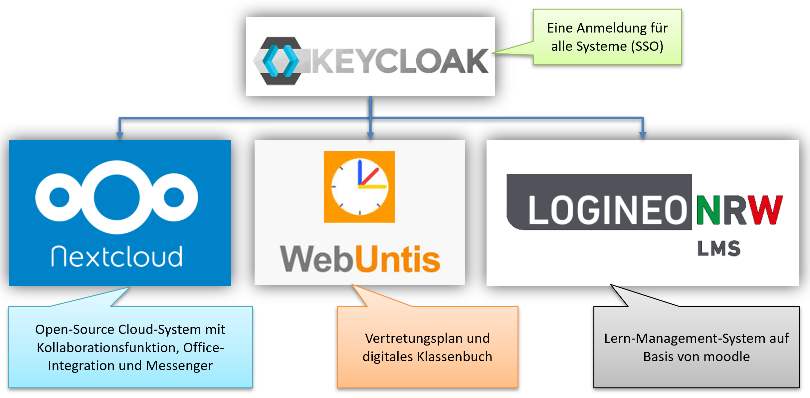

# Die digitalen Konzept am Luisen-Gmynasium

<!-- <figure markdown>
  { loading=lazy style="margin:auto;width:80%" }
  <figcaption>Abbildung 1: Digitalstruktur am Luisen-Gymnasium</figcaption>
</figure> -->

So wie das Schulkonzept aus drei Säulen besteht, besteht auch das digitale Konzept des Luisen-Gymnasiums aus drei Säulen: Webuntis, Moodle und Nextcloud. Diese drei Plattformen decken den digitalen Part der folgenden wichtigen Bereiche des Schullebens ab: Kommunikation, Information und Interaktion.

<figure markdown>
  { loading=lazy }
  <!-- <figcaption>Abbildung 1: Digitalstruktur am Luisen-Gymnasium</figcaption> -->
</figure>

<!-- { loading=lazy style="margin:auto;width:80%" } -->

Wie in der Abbildung oben zu sehen ist den drei Säulen keycloak als Single Sign-On (SSO) vorgeschaltet, so dass man sich nicht für jede Plattform unterschiedliche Passwörter merken muss und die Schule nur eine Userdatenbank pflegen muss.

## Information
Webuntis ist der Ort, an dem Informationen organisiert werden. Hier können Nachrichten an Klassengruppen gesendet werden, und die Schüler können ihre Änderungen im Stundenplan und Vertretungsstunden einsehen.

## Kommunikation
Die Kommunikation erfolgt über Nextcloud Talk, einen Messenger Whatsapp und Signal ähnlich, aber auf die Schulgemeinschaft beschränkt. Hier können Gruppen erstellt werden, aber auch Informationen im 1:1 Gespräch ausgetauscht werden. Dies sowohl als Chat, als auch als Audio- oder Videokonferenz. Kommunikation ist aber nicht nur wichtig zwischen Personen, sondern aufgrund der großen Anzahl an schuleigenen iPads zwischen den Geräten, die Schüler an unterschiedlichen Tagen nutzen. Hierfür besteht mit Nextcloud die Möglichkeit ähnlich wie bei Onedrive, Google Drive, Dropbox die Sachen in einem Cloudspeicher zwischenzuspeichern.

## Interaktion
Die Interaktion wird durch Moodle ermöglicht, ein Lernmanagementsystem, das vom Land Nordrhein-Westfalen zur Verfügung gestellt wird und in der gesamten Schule eingesetzt wird. Es ermöglicht die Erfassung von Aufgaben, die Bereitstellung von Übungen und Tests und damit auch das selbstorganisierte Lernen. Außerdem ist Collabora, ein Online-Office, das die gemeinsame Arbeit an Dokumenten ermöglicht, Teil von Nextcloud und kann für kollaborative Projekte genutzt werden.